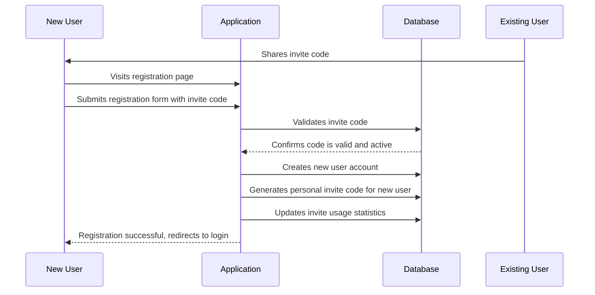
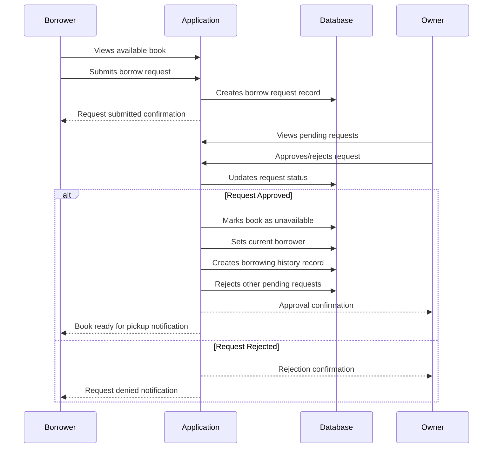
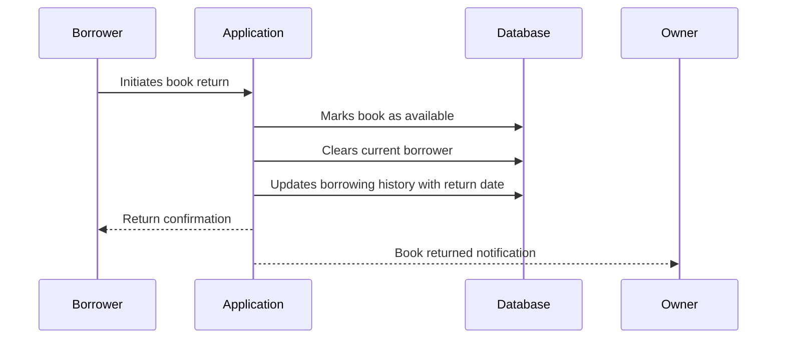

# Book Sharing Application Documentation

## Overview

The Book Sharing Application is a Flask-based web application that enables communities to share books through an invite-only system. Users can add books to their personal library, browse available books from other users, request to borrow books, and track borrowing history.

## Key Features

- **Invite-only registration** - Maintains a trusted community through invite codes
- **Book management** - Add, edit, and categorize books (fiction/non-fiction)
- **Borrowing system** - Request, approve/reject, and track book loans
- **Social features** - Comments and upvotes on books
- **User profiles** - Manage personal library and borrowing history
- **Dashboard views** - Browse all books or filter by availability/category

## Architecture

### Technology Stack

- **Backend**: Flask 3.0.2 with SQLAlchemy 2.0.28 ORM
- **Database**: SQLite (file-based at `instance/bookshare.db`)
- **Authentication**: Flask-Login with session management
- **Forms**: Flask-WTF with CSRF protection
- **Templates**: Jinja2 template engine
- **Production**: Gunicorn with Gevent workers
- **Migrations**: Flask-Migrate with Alembic

### Application Structure

```
sdd-workshop-book-sharing-app/
├── run.py                    # Application entry point
├── wsgi.py                   # WSGI entry point for production
├── requirements.txt          # Python dependencies
├── gunicorn_config.py        # Production server configuration
├── .env                      # Environment variables
└── src/                      # Main application code
    ├── app.py                # Application factory
    ├── extensions.py         # Flask extensions
    ├── models/               # SQLAlchemy models
    ├── routes/               # Blueprint route handlers
    ├── forms/                # WTForms definitions
    ├── templates/            # Jinja2 templates
    └── static/               # CSS and images
```

## Data Model

The application uses 7 main database tables:

### Core Entities

1. **Users** - User accounts with invite tracking
2. **Books** - Book definitions with availability status
3. **Invite Codes** - Manages invite-only registration
4. **Borrow Requests** - Handles borrowing workflow
5. **Borrowing History** - Tracks completed loans
6. **Book Comments** - User comments on books
7. **Book Upvotes** - User ratings/likes for books

### Key Relationships

- Users own books and can borrow from others
- Books have comments, upvotes, and borrowing history
- Invite codes track user registration chain
- Borrow requests manage the lending workflow

## Application Workflows

### User Registration Flow



### Book Borrowing Flow



### Book Return Flow



## Getting Started

### Prerequisites

- Python 3.8 or higher
- pip or uv package manager

### Local Development Setup

1. **Clone and navigate to the project**:
   ```bash
   cd sdd-workshop-book-sharing-app
   ```

2. **Install dependencies**:
   ```bash
   # Using pip
   pip install -r requirements.txt
   
   # Using uv (recommended)
   uv sync
   ```

3. **Set up environment variables**:
   Create a `.env` file in the project root:
   ```env
   SECRET_KEY=your-secret-key-here
   FLASK_DEBUG=true
   ```

4. **Initialize the database**:
   The database will be automatically created on first run at `instance/bookshare.db`

5. **Run the development server**:
   ```bash
   # Using Python directly
   python run.py
   
   # Using uv
   uv run python run.py
   ```

6. **Access the application**:
   Open your browser to `http://localhost:5000`

7. **Register your first user**:
   Use the initial invite code: `INITIAL`

### Production Deployment

#### Option 1: Using Gunicorn Directly

1. **Install dependencies**:
   ```bash
   pip install -r requirements.txt
   ```

2. **Set production environment variables**:
   ```env
   SECRET_KEY=your-production-secret-key
   FLASK_DEBUG=false
   GUNICORN_BIND=0.0.0.0:8000
   GUNICORN_WORKERS=4
   ```

3. **Run with Gunicorn**:
   ```bash
   gunicorn -c gunicorn_config.py wsgi:application
   ```

#### Option 2: Using Procfile (Heroku-style)

1. **Use the included Procfile**:
   ```
   web: gunicorn -c gunicorn_config.py wsgi:application
   ```

2. **Deploy to your platform** (Heroku, Railway, etc.)

### Configuration Options

#### Environment Variables

| Variable | Default | Description |
|----------|---------|-------------|
| `SECRET_KEY` | `'dev'` | Flask secret key for sessions |
| `FLASK_DEBUG` | `false` | Enable debug mode |
| `GUNICORN_BIND` | `0.0.0.0:8000` | Server bind address |
| `GUNICORN_WORKERS` | `cpu_count * 2 + 1` | Number of worker processes |
| `GUNICORN_WORKER_CLASS` | `gevent` | Worker class type |
| `GUNICORN_TIMEOUT` | `30` | Request timeout in seconds |
| `GUNICORN_LOG_LEVEL` | `info` | Logging level |

#### Database Configuration

- **Development**: SQLite database at `instance/bookshare.db`
- **Production**: Can be configured via `SQLALCHEMY_DATABASE_URI` environment variable
- **Migrations**: Handled automatically via Flask-Migrate

## API Endpoints

### Authentication Routes (`/auth`)

- `GET /auth/login` - Login form
- `POST /auth/login` - Process login
- `GET /auth/register` - Registration form  
- `POST /auth/register` - Process registration
- `GET /auth/logout` - Logout user

### Book Routes (`/books`)

- `GET /books/` - List all books
- `GET /books/<id>` - View book details
- `GET /books/create` - Book creation form
- `POST /books/create` - Create new book
- `GET /books/<id>/edit` - Edit book form
- `POST /books/<id>/edit` - Update book
- `POST /books/<id>/comment` - Add comment
- `POST /books/<id>/upvote` - Toggle upvote
- `POST /books/<id>/borrow` - Request to borrow
- `POST /books/<id>/return` - Return borrowed book
- `POST /books/requests/<id>/approve` - Approve borrow request
- `POST /books/requests/<id>/reject` - Reject borrow request

### Profile Routes (`/profile`)

- `GET /profile/` - User profile
- `GET /profile/edit` - Edit profile form
- `POST /profile/edit` - Update profile
- `GET /profile/books` - User's books
- `GET /profile/borrowed` - Currently borrowed books
- `GET /profile/history` - Borrowing history
- `GET /profile/requests` - Pending borrow requests
- `GET /profile/invite` - Invite code management

### Main Routes

- `GET /` - Dashboard (all books or available only)

## Security Features

- **CSRF Protection**: All forms protected with Flask-WTF
- **Password Hashing**: Werkzeug secure password hashing
- **Session Management**: Flask-Login handles user sessions
- **Input Validation**: WTForms validates all user input
- **SQL Injection Protection**: SQLAlchemy ORM prevents SQL injection
- **Invite-only Registration**: Prevents unauthorized access

## Database Schema

### Users Table
```sql
CREATE TABLE users (
    user_id INTEGER PRIMARY KEY AUTOINCREMENT,
    email VARCHAR(255) UNIQUE NOT NULL,
    password_hash VARCHAR(255) NOT NULL,
    alias VARCHAR(100) NOT NULL,
    bio TEXT,
    registration_date TIMESTAMP DEFAULT CURRENT_TIMESTAMP,
    invite_code_used VARCHAR(20) NOT NULL,
    personal_invite_code VARCHAR(20) UNIQUE NOT NULL,
    invites_used_count INTEGER DEFAULT 0,
    is_active BOOLEAN DEFAULT TRUE
);
```

### Books Table
```sql
CREATE TABLE books (
    book_id INTEGER PRIMARY KEY AUTOINCREMENT,
    owner_id INTEGER NOT NULL,
    title VARCHAR(255) NOT NULL,
    author VARCHAR(255) NOT NULL,
    isbn VARCHAR(20),
    purchase_url VARCHAR(512),
    recommendation_rating INTEGER CHECK (recommendation_rating BETWEEN 1 AND 5),
    is_available BOOLEAN DEFAULT TRUE,
    is_hidden BOOLEAN DEFAULT FALSE,
    is_fiction BOOLEAN DEFAULT TRUE,
    current_borrower_id INTEGER,
    created_at TIMESTAMP DEFAULT CURRENT_TIMESTAMP,
    updated_at TIMESTAMP DEFAULT CURRENT_TIMESTAMP,
    FOREIGN KEY (owner_id) REFERENCES users (user_id),
    FOREIGN KEY (current_borrower_id) REFERENCES users (user_id)
);
```

## Troubleshooting

### Common Issues

1. **Database not found**: Ensure the `instance/` directory exists and is writable
2. **Import errors**: Verify all dependencies are installed via `pip install -r requirements.txt`
3. **Port conflicts**: Change the port in `run.py` if 5000 is in use (common on macOS with AirPlay)
4. **Permission errors**: Ensure the application has write access to the `instance/` directory

### Development Tips

- Use `FLASK_DEBUG=true` for detailed error messages
- Check `instance/bookshare.db` exists after first run
- Initial invite code is `INITIAL` for first user registration
- Database tables are created automatically on startup

### Production Considerations

- Set a strong `SECRET_KEY` environment variable
- Use a production database (PostgreSQL, MySQL) for scalability
- Configure proper logging and monitoring
- Set up SSL/TLS termination
- Consider using a reverse proxy (nginx) for static files
- Regular database backups recommended

## Contributing

The application follows Flask best practices:

- Blueprint organization for routes
- Application factory pattern
- SQLAlchemy models with relationships
- WTForms for validation
- Jinja2 templates with inheritance
- Static file organization

For development, ensure all new features include appropriate tests and follow the existing code structure.
