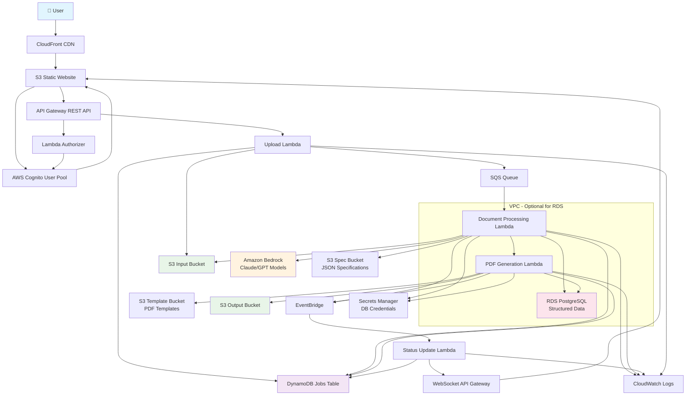

# AWS Serverless Architecture: Agentic Document Extractor

## Architecture Overview



## Component Details

### 1. Frontend & CDN Layer
- **CloudFront**: Global CDN for fast content delivery
- **S3 Static Website**: Hosts React/Vue.js SPA for file upload interface
- **Real-time Updates**: WebSocket connection for status updates

### 2. Authentication & Authorization
- **AWS Cognito User Pool**: User authentication and management
- **Lambda Authorizer**: JWT token validation for API requests
- **IAM Roles**: Fine-grained permissions for each Lambda function

### 3. API Layer
- **API Gateway REST API**: Main API endpoints for file operations
- **WebSocket API Gateway**: Real-time status updates to frontend
- **CORS Configuration**: Proper cross-origin resource sharing setup

### 4. Core Processing Pipeline

#### Upload Handler Lambda
```python
# Pseudo-code structure
def lambda_handler(event, context):
    # Generate presigned URL for S3 upload
    # Create job record in DynamoDB
    # Send message to SQS for processing
    # Return job ID to client
```

#### Document Processing Lambda
```python
# Pseudo-code structure
def lambda_handler(event, context):
    # Download PDF from S3
    # Load JSON specification from S3
    # Use Bedrock AI to extract structured data
    # Store results in RDS PostgreSQL
    # Trigger PDF generation
    # Update job status
```

#### PDF Generation Lambda
```python
# Pseudo-code structure
def lambda_handler(event, context):
    # Fetch structured data from RDS
    # Load PDF template from S3
    # Generate new PDF using template
    # Upload to S3 output bucket
    # Update job status to complete
```

### 5. Data Storage
- **S3 Input Bucket**: Stores uploaded PDF documents
- **S3 Spec Bucket**: JSON specifications for data extraction
- **S3 Template Bucket**: PDF templates for output generation
- **S3 Output Bucket**: Generated PDF files
- **RDS PostgreSQL**: Structured extracted data
- **DynamoDB**: Job status and metadata tracking

### 6. AI/ML Services
- **Amazon Bedrock**: Claude 3 or GPT-4 for intelligent document extraction
- **Alternative**: Amazon Textract + Comprehend for simpler extraction

### 7. Messaging & Events
- **SQS Queue**: Decouples upload from processing
- **EventBridge**: Orchestrates status updates and notifications
- **Dead Letter Queue**: Handles failed processing attempts

### 8. Monitoring & Observability
- **CloudWatch Logs**: Centralized logging for all Lambda functions
- **CloudWatch Metrics**: Performance monitoring and alerting
- **X-Ray**: Distributed tracing for debugging

## Deployment Architecture

### Infrastructure as Code
```yaml
# serverless.yml or CDK structure
service: document-extractor

provider:
  name: aws
  runtime: python3.11
  region: us-east-1
  
functions:
  upload:
    handler: handlers/upload.handler
    events:
      - http:
          path: /upload
          method: post
          authorizer: auth
          
  process:
    handler: handlers/process.handler
    timeout: 900  # 15 minutes
    events:
      - sqs:
          arn: !GetAtt ProcessingQueue.Arn
          
  generate:
    handler: handlers/generate.handler
    timeout: 300  # 5 minutes
    
  status:
    handler: handlers/status.handler
    events:
      - eventbridge:
          pattern:
            source: ["document.processor"]
```

## Security Considerations

### 1. Data Protection
- **Encryption at Rest**: All S3 buckets and RDS encrypted with KMS
- **Encryption in Transit**: HTTPS/TLS for all communications
- **VPC**: RDS and processing Lambdas in private subnets

### 2. Access Control
- **Cognito**: Multi-factor authentication support
- **IAM Policies**: Least privilege access for all resources
- **S3 Bucket Policies**: Restrict access to authenticated users only

### 3. Secrets Management
- **AWS Secrets Manager**: Database credentials and API keys
- **Parameter Store**: Configuration values and non-sensitive settings

## Cost Optimization

### Serverless Benefits
- **Pay-per-use**: Only charged for actual processing time
- **Auto-scaling**: Handles variable workloads efficiently
- **No idle costs**: No charges when system is not in use

### Estimated Monthly Costs (Low Volume)
- **Lambda**: $5-20 (based on processing time)
- **S3**: $5-15 (storage and requests)
- **RDS Serverless**: $20-50 (Aurora Serverless v2)
- **Cognito**: $0-5 (first 50,000 MAUs free)
- **API Gateway**: $3-10 (per million requests)
- **Bedrock**: $10-100 (based on token usage)

**Total Estimated**: $43-200/month for low to medium usage

## Scalability Features

### Automatic Scaling
- **Lambda Concurrency**: Up to 1000 concurrent executions
- **SQS**: Unlimited message throughput
- **RDS Aurora Serverless**: Auto-scales based on demand
- **CloudFront**: Global edge locations for performance

### Performance Optimizations
- **Lambda Layers**: Shared dependencies for faster cold starts
- **Connection Pooling**: RDS Proxy for database connections
- **Caching**: CloudFront and API Gateway caching
- **Batch Processing**: Process multiple documents in parallel

## Deployment Strategy

### CI/CD Pipeline
1. **GitHub Actions** or **AWS CodePipeline**
2. **Automated Testing**: Unit and integration tests
3. **Infrastructure Deployment**: CDK or Serverless Framework
4. **Blue/Green Deployment**: Zero-downtime updates
5. **Rollback Capability**: Quick reversion if issues arise

This architecture provides a robust, scalable, and cost-effective solution for your agentic document extractor while maintaining high availability and security standards.
